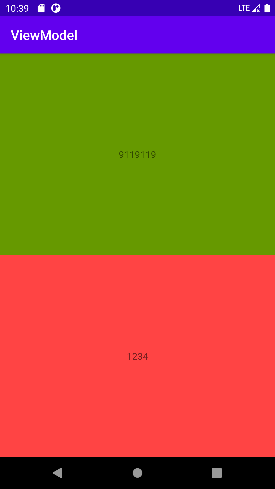
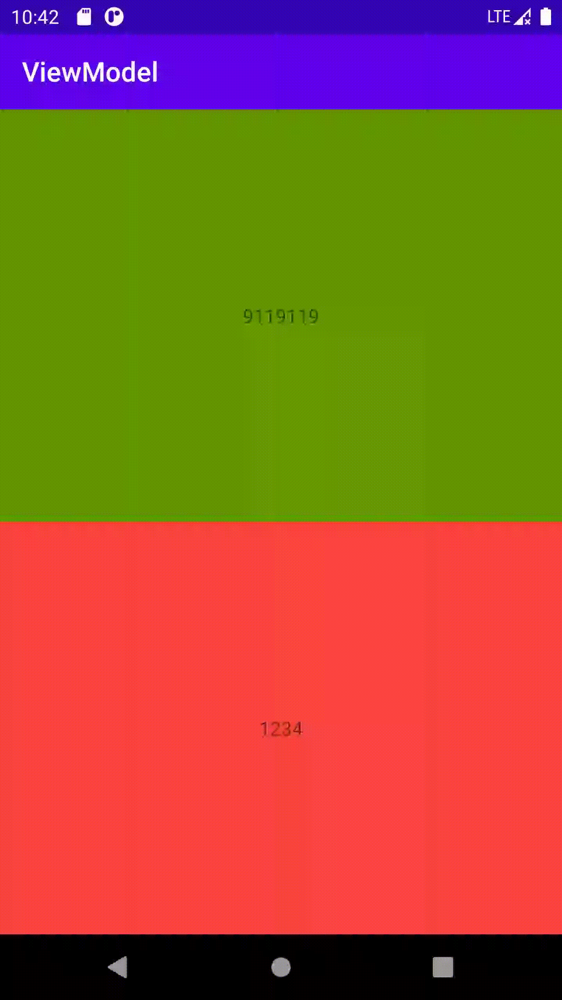

# Share data between fragments with ViewModel






## ViewModelActivity

 Add two fragment

```java
public class ViewModelActivity extends AppCompatActivity {

    @Override
    protected void onCreate(Bundle savedInstanceState) {
        super.onCreate(savedInstanceState);
        setContentView(R.layout.view_model_activity);
        if (savedInstanceState == null) {
            getSupportFragmentManager().beginTransaction()
                    .replace(R.id.fg_master, MasterFragment.newInstance())
                    .replace(R.id.fg_detail, DetailFragment.newInstance())
                    .commitNow();
        }
    }
}
```

## SharedViewModel

get set method with MutableLiveData

```java
public class SharedViewModel extends ViewModel {
    private MutableLiveData<Integer> mData = new MutableLiveData<>();
    private Random mRandom = new Random();

    public LiveData<Integer> getData() {
        return mData;
    }

    public void setData(int num) {
        mData.setValue(num);
    }

    public void onNextRandom() {
        int next = mRandom.nextInt();
        setData(next);
    }
}
```

## MasterFragment and DetailFragment

**MasterFragment** show a textView with a random number, when you click the it, the number will reload.**DetailFragment** show the number from MasterFragment.

### Use activity's ViewModel

```java
ViewModelProviders.of(requireActivity()).get(SharedViewModel.class);
```

### Inject viewModel and set Lifecycle Owner

```java
mBinding.setSharedViewModel(mSharedViewModel);
mBinding.setLifecycleOwner(getViewLifecycleOwner());
```

## **[This approach offers the following benefits](https://developer.android.com/topic/libraries/architecture/viewmodel#sharing):**

- The activity does not need to do anything, or know anything about this communication.
- Fragments don't need to know about each other besides the `SharedViewModel` contract. If one of the fragments disappears, the other one keeps working as usual.
- Each fragment has its own lifecycle, and is not affected by the lifecycle of the other one. If one fragment replaces the other one, the UI continues to work without any problems.